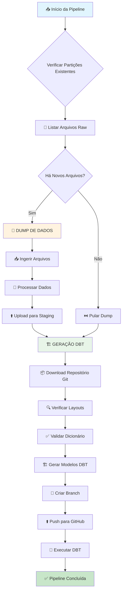

# Pipeline CadÚnico - Sistema de Proteção Social

Pipeline automatizada para ingestão de dados do CadÚnico (Cadastro Único para Programas Sociais) e geração de modelos DBT para materialização no BigQuery.

## 📋 Visão Geral

Esta pipeline processa dados do CadÚnico em duas etapas principais:
1. **Dump de Dados**: Ingestão otimizada de arquivos raw para staging
2. **Geração DBT**: Criação automática de modelos DBT e materialização

O sistema utiliza layouts versionados para garantir compatibilidade entre diferentes versões dos dados, validação automática de dicionários e integração Git para versionamento de código.

## 🔄 Fluxo da Pipeline



---

## 🔧 Grupo 1: Dump de Dados

O processo de dump é responsável por ingerir e processar arquivos raw do CadÚnico de forma otimizada e incremental.

### 🎯 Objetivo
- Verificar partições já processadas
- Identificar novos arquivos para ingestão
- Processar e fazer upload para área de staging

### 📊 Tasks do Dump

#### `get_existing_partitions_task`
**Arquivo**: `tasks.py:26`
**Função**: Lista partições já processadas na área de staging
```python
def get_existing_partitions_task(prefix: str, bucket_name: str, dataset_id: str, table_id: str) -> List[str]
```

#### `get_files_to_ingest_task`
**Arquivo**: `tasks.py:31`
**Função**: Identifica arquivos novos comparando raw vs staging
```python
def get_files_to_ingest_task(prefix: str, partitions: List[str], bucket_name: str) -> List[str]
```

#### `need_to_ingest_task`
**Arquivo**: `tasks.py:36`
**Função**: Determina se há arquivos para processar
```python
def need_to_ingest_task(files_to_ingest: list) -> bool
```

#### `ingest_files_task`
**Arquivo**: `tasks.py:41`
**Função**: Processa arquivos de forma assíncrona com controle de concorrência
```python
def ingest_files_task(files_to_ingest: List[str], bucket_name: str, dataset_id: str, table_id: str, max_concurrent: int = 3) -> None
```

### 🔧 Utils do Dump

#### `utils_dump.py`
**Funções principais**:
- `get_existing_partitions()`: Lista partições em staging
- `get_files_to_ingest()`: Compara raw vs staging
- `ingest_files()`: Processamento assíncrono de arquivos
- `need_to_ingest()`: Validação de necessidade de ingestão

**Características**:
- ✅ Processamento incremental (só novos arquivos)
- ✅ Controle de concorrência configurável
- ✅ Upload direto para BigQuery
- ✅ Logs detalhados de progresso

---

## 🏗️ Grupo 2: Geração DBT e Materialização

O processo de geração DBT cria automaticamente modelos compatíveis com diferentes versões de layout e os materializa no BigQuery.

### 🎯 Objetivo
- Sincronizar layouts do storage com staging
- Validar dicionário de colunas
- Gerar modelos DBT automaticamente
- Fazer push para repositório Git
- Executar materialização no BigQuery

### 📊 Tasks da Geração DBT

#### `download_repository_task`
**Arquivo**: `tasks.py:58`
**Função**: Baixa repositório Git para geração de modelos
```python
def download_repository_task(git_repository_path: str, branch: str = "master") -> str
```

#### `update_layout_from_storage_and_create_versions_dbt_models_task`
**Arquivo**: `tasks.py:64`
**Função**: Núcleo da pipeline - sincroniza layouts e gera modelos
```python
def update_layout_from_storage_and_create_versions_dbt_models_task(
    dataset_id: str = "brutos_cadunico",
    layout_table_id: str = "layout",
    # ... outros parâmetros
)
```

#### `push_models_to_branch_task`
**Arquivo**: `tasks.py:87`
**Função**: Faz commit e push dos modelos gerados
```python
def push_models_to_branch_task(
    repository_path: str,
    github_token: Optional[str] = None,
    commit_message: str = "feat: update CadUnico models"
) -> bool
```

#### `execute_dbt_task`
**Arquivo**: `tasks.py:107`
**Função**: Executa DBT run para materialização
```python
def execute_dbt_task(target: str = "prod", select: str = "--select raw.smas.protecao_social_cadunico")
```

### 🔧 Utils da Geração DBT

#### `utils_layout.py` - Processamento de Layouts
**Funções principais**:

##### Validação e Sincronização
- `get_layout_table_from_staging()` (linha 289): Valida dicionário de colunas
- `download_files_from_storage_raw()` (linha 222): Baixa layouts novos
- `parse_xlsx_files_and_save_partition()` (linha 167): Processa arquivos Excel

##### Geração de Modelos
- `create_cadunico_dbt_consolidated_models()` (linha 501): Gera modelos DBT
- `parse_columns_version_control()` (linha 413): Controle de versões cross-layout
- `columns_version_control_diff()` (linha 376): Análise de diferenças entre versões

**Características do Layout**:
- ✅ **Validação automática**: Verifica se todas as colunas têm dicionário
- ✅ **Controle de versões**: Compatibilidade entre versões diferentes
- ✅ **Geração automática**: Modelos DBT com transformações complexas
- ✅ **Tratamento de tipos**: DATE, INT64, FLOAT64 com validações

#### `utils_dbt.py` - Integração Git e DBT
**Funções principais**:

##### Git Operations
- `download_repository()` (linha 27): Clone de repositório com branch específica
- `push_models_to_branch()` (linha 74): Push com autenticação via token
- `get_github_token()` (linha 11): Validação de token de ambiente

##### DBT Execution
- `execute_dbt()` (linha 190): Execução com PrefectDbtRunner
  - Instala dependências automaticamente
  - Suporta múltiplos comandos (run, test, build)
  - Tratamento gracioso de erros

**Características do DBT**:
- ✅ **Autenticação segura**: GitHub token via variável de ambiente
- ✅ **Commits descritivos**: Mensagens automáticas com contexto
- ✅ **Execução robusta**: deps + run com tratamento de erros
- ✅ **Flexibilidade**: targets e seleções configuráveis

---

## ⚙️ Configuração e Uso

### Variáveis de Ambiente Necessárias
```bash
GITHUB_TOKEN=ghp_xxxxxxxxxxxxx  # Token com permissões repo, contents:write
```

### Parâmetros do Flow
```python
@flow
def rj_smas__cadunico(
    raw_bucket: str = "rj-smas",
    raw_prefix_area: str = "raw/protecao_social_cadunico/registro_familia",
    staging_bucket: str = "rj-iplanrio",
    dataset_id: str = "brutos_cadunico",
    max_concurrent: int = 3,
    force_create_models: bool = False,
    git_repository_path: str = "https://github.com/prefeitura-rio/queries-rj-iplanrio",
    branch: str = "cadunico",
    dbt_target: str = "prod",
    dbt_select: str = "--select raw.smas.protecao_social_cadunico"
)
```

### Estrutura de Arquivos Gerados
```
dbt_repository/
└── models/raw/smas/protecao_social_cadunico/
    ├── raw_protecao_social_cadunico__controle.sql
    ├── raw_protecao_social_cadunico__controle.yml
    ├── raw_protecao_social_cadunico__familia.sql
    ├── raw_protecao_social_cadunico__familia.yml
    └── ... (outros modelos)
```

---

## 🔍 Características Técnicas

### Otimizações
- **Processamento incremental**: Só processa dados novos
- **Concorrência controlada**: Upload paralelo com limite configurável
- **Validação prévia**: Verifica dicionários antes da geração
- **Cache inteligente**: Reutiliza layouts já processados

### Tratamento de Erros
- **Validação de dicionário**: Para pipeline se colunas faltam
- **Verificação de versões**: Garante layouts necessários existem
- **Git operations**: Trata falhas de push/clone graciosamente
- **DBT execution**: Logs detalhados para debugging

### Monitoramento
- **Logs estruturados**: Informações detalhadas em cada etapa
- **Comparação de versões**: Raw vs staging em tempo real
- **Progresso de arquivos**: Contadores e percentuais
- **URLs de console**: Links diretos para GCS e BigQuery

---

## 📈 Métricas e Validação

### Durante Execução
- Número de arquivos processados
- Partições criadas vs existentes
- Modelos DBT gerados
- Status de push para Git
- Resultado da materialização DBT

### Validação de Qualidade
- ✅ Integridade de dados preservada
- ✅ Compatibilidade entre versões de layout
- ✅ Transformações aplicadas corretamente
- ✅ Metadados e descrições propagados