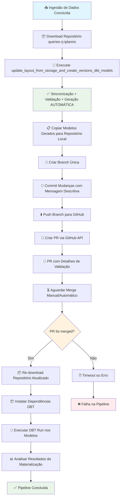

# Migração Pipeline CadÚnico - Plano Detalhado

## 📋 Visão Geral da Migração

Migração da atual materialização do CadÚnico (via `create_flow_run` aninhado) para nova arquitetura DBT customizada com **execução on-demand**, **validação automática de dicionário** e **PRs automáticos**.

---

## 🔄 Workflow Visual da Nova Pipeline

---

## 📖 Detalhamento das Etapas

### 1. **Preparação do Ambiente**
- **1.1** Configurar variável de ambiente `GITHUB_TOKEN` com permissões adequadas
- **1.2** Validar acesso ao repositório `queries-rj-iplanrio`
- **1.3** Verificar credenciais BigQuery para execução DBT

### 2. **Download do Repositório**
- **2.1** Limpar diretório de trabalho existente (`/tmp/dbt_repository`)
- **2.2** Clonar repositório completo via Git
- **2.3** Verificar existência da pasta `queries` dentro do repositório
- **2.4** Confirmar estrutura esperada (`dbt_project.yml`, `models/`, etc.)

### 3. **Sincronização + Validação + Geração (REUTILIZAR CÓDIGO ATUAL)**
- **3.1** **Executar função existente**: `update_layout_from_storage_and_create_versions_dbt_models()`
  - ✅ **JÁ FAZ**: Verifica novos layouts no GCS vs. tabela staging
  - ✅ **JÁ FAZ**: Baixa e faz parse apenas de layouts novos
  - ✅ **JÁ FAZ**: Cria/atualiza tabela `layout_staging`
  - ✅ **JÁ FAZ**: Gera modelos DBT com todas as transformações
- **3.2** **NOVA VALIDAÇÃO**: Executar `validate_layout_dictionary()` **ANTES** da geração
  - Query automática entre `layout` e `layout_dicionario_colunas`
  - Gerar warnings detalhados para colunas sem dicionário
  - Logs informativos para acompanhamento
- **3.3** **ADAPTAÇÃO SIMPLES**: Modificar geração para incluir headers com warnings
  - Se validação passou: Header padrão
  - Se há warnings: Header com lista de colunas sem dicionário
- **3.4** **COPIAR PARA REPOSITÓRIO**: Modelos gerados para diretório do repositório baixado

### 4. **Criação de Pull Request Automático**
- **4.1** Navegar para diretório do repositório clonado
- **4.2** Configurar remote origin para GitHub
- **4.3** Criar branch única com timestamp (`cadunico-models-update-YYYYMMDD_HHMMSS`)
- **4.4** Adicionar apenas arquivos da pasta `models/protecao_social_cadunico/`
- **4.5** Verificar se existem mudanças reais para commit
- **4.6** Criar commit com mensagem descritiva incluindo:
  - Número de modelos atualizados
  - Status da validação (aprovada ou warnings)
  - Timestamp da geração
- **4.7** Push da branch para repositório remoto
- **4.8** Criar PR via GitHub API com:
  - **Título**: Descritivo com timestamp
  - **Corpo**: Detalhes completos da atualização
  - **Lista**: Modelos incluídos
  - **Seção validação**: Colunas faltantes (se houver)
  - **Ações recomendadas**: Checklist para revisão

### 5. **Aguardo de Merge**
- **5.1** Configurar timeout para aguardo (padrão: 30 minutos)
- **5.2** Verificar status do PR periodicamente (padrão: 60 segundos)
- **5.3** Logs informativos sobre:
  - Número de warnings (se houver)
  - Tempo decorrido desde criação
  - URL do PR para acompanhamento manual
- **5.4** Detectar states do PR:
  - **Merged**: Prosseguir para próxima etapa
  - **Closed sem merge**: Erro e parada da pipeline
  - **Timeout**: Erro após tempo limite

### 6. **Re-download do Repositório Atualizado**
- **6.1** Limpar diretório de trabalho atual
- **6.2** Clonar novamente o repositório (agora com modelos atualizados)
- **6.3** Verificar que modelos foram aplicados corretamente
- **6.4** Confirmar estrutura DBT válida

### 7. **Execução DBT Customizada**
- **7.1** Navegar para diretório do repositório atualizado
- **7.2** Verificar existência de `dbt_project.yml`
- **7.3** Inicializar PrefectDbtRunner com configurações apropriadas
- **7.4** Executar `dbt deps` para instalar dependências
- **7.5** Executar `dbt run` com seleção específica:
  - **Target**: `prod`
  - **Select**: `protecao_social_cadunico.*`
- **7.6** Capturar e analisar resultados:
  - Modelos executados com sucesso
  - Modelos com falha
  - Tempo de execução
  - Logs detalhados

### 8. **Análise de Resultados e Finalização**
- **8.1** Processar output do DBT para extrair estatísticas
- **8.2** Gerar logs finais com resumo da execução
- **8.3** Reportar status final da pipeline (sucesso/falha)
- **8.4** Limpeza de arquivos temporários

---

## 🔧 Modificações Necessárias

### No Arquivo `flows.py`
- **Remover**: Bloco atual com `create_flow_run` e `wait_for_flow_run`
- **Adicionar**: Imports das novas tasks customizadas
- **Substituir**: Lógica de materialização por chamadas sequenciais das novas tasks
- **Manter**: Mesmos parâmetros e condições (`materialize_after_dump`)

### No Arquivo `tasks.py`
- **Adicionar**: 5 novas tasks simples (aproveitando código existente):
  1. `download_repository_task`
  2. `enhanced_update_layout_and_create_models_task` (**REUTILIZAR + VALIDAÇÃO**)
  3. `create_github_pr_with_models`
  4. `wait_for_pr_merge`
  5. `execute_dbt_cadunico_task`

### No Arquivo `utils.py`
- **MÍNIMAS MODIFICAÇÕES**: Apenas adicionar função de validação de dicionário
- **REUTILIZAR**: Todas as funções existentes de sincronização e geração
- **Adicionar**: Funções auxiliares para:
  - Validação de dicionário (nova)
  - Headers com warnings (nova)
  - Análise de resultados DBT (nova)
  - Formatação de mensagens de commit e PR (nova)

---

## 📋 Todo List Detalhado

### 🔧 **Preparação do Ambiente**
- [ ] Criar token GitHub com permissões `repo`, `pull_requests:write`, `contents:write`
- [ ] Configurar `GITHUB_TOKEN` como variável de ambiente no Kubernetes/Prefect
- [ ] Testar acesso ao repositório `queries-rj-iplanrio` com o token
- [ ] Validar credenciais BigQuery para target `prod`

### 📝 **Desenvolvimento - Semana 1** (**SIMPLIFICADO**)
- [ ] Implementar `download_repository_task` (baseada na função original)
- [ ] Implementar `validate_layout_dictionary` (apenas query de validação)
- [ ] Criar `enhanced_update_layout_and_create_models_task` (**REUTILIZAR + validação**)
- [ ] Adicionar função de headers com warnings nos modelos
- [ ] Implementar logs detalhados para debugging

### 🏗️ **Desenvolvimento - Semana 2** (**SIMPLIFICADO**)
- [ ] Implementar `create_github_pr_with_models`
- [ ] Implementar `wait_for_pr_merge` com timeout configurável
- [ ] Implementar `execute_dbt_cadunico_task`
- [ ] Criar templates para mensagens de commit e corpo do PR
- [ ] Testar criação de PRs em repositório de desenvolvimento

### ⏳ **Desenvolvimento - Semana 3** (**INTEGRAÇÃO**)
- [ ] Integrar todas as tasks no flow principal
- [ ] Adicionar imports necessários
- [ ] Remover lógica antiga de materialização (`create_flow_run`)
- [ ] Criar função de análise de resultados DBT
- [ ] Testes end-to-end da nova pipeline

### 🧪 **Testes - Semana 3** (**SIMPLIFICADO**)
- [ ] Criar ambiente de teste isolado
- [ ] Testar função `enhanced_update_layout_and_create_models_task` (reutilização)
- [ ] Validar validação de dicionário e warnings
- [ ] Testar criação e merge de PRs
- [ ] Validar execução DBT customizada
- [ ] Testar cenários de erro (timeout, falha de merge, etc.)

### 📊 **Validação - Semana 4**
- [ ] Comparar dados materializados com processo atual
- [ ] Validar integridade de transformações (padronização, de-para)
- [ ] Confirmar compatibilidade entre versões de layout
- [ ] Testar performance comparativa
- [ ] Validar logs e monitoramento

### 🚀 **Deploy em Produção - Semana 4**
- [ ] Backup da configuração atual
- [ ] Deploy das mudanças em ambiente de produção
- [ ] Configurar monitoramento específico para nova pipeline
- [ ] Executar primeira run supervisionada
- [ ] Validar dados produzidos vs. esperados
- [ ] Documentar mudanças e processo de rollback

### 📚 **Documentação e Handover**
- [ ] Atualizar documentação técnica da pipeline
- [ ] Criar guia de troubleshooting para novos erros
- [ ] Documentar processo de validação manual (fallback)
- [ ] Treinar equipe nas novas funcionalidades
- [ ] Criar alertas específicos para warnings de validação

### 🔍 **Monitoramento Pós-Deploy**
- [ ] Acompanhar primeiras 3 execuções em produção
- [ ] Validar alertas e notificações
- [ ] Confirmar performance dentro do esperado
- [ ] Coletar feedback da equipe
- [ ] Ajustar thresholds de timeout se necessário

---

## 📈 Métricas de Sucesso

### **Funcionais**
- ✅ Dados materializados idênticos ao processo atual
- ✅ Transformações preservadas (padronização + de-para)
- ✅ Compatibilidade entre versões de layout mantida
- ✅ Warnings automáticos para colunas sem dicionário

### **Operacionais**
- ✅ PRs automáticos criados com informações completas
- ✅ Timeout de merge configurável e funcional
- ✅ Logs detalhados para debugging
- ✅ Execução DBT bem-sucedida em 100% dos casos válidos

### **Performance**
- ✅ Tempo total de execução similar ou melhor que atual
- ✅ Uso eficiente de recursos (reutilização de repositório)
- ✅ Falhas detectadas e reportadas rapidamente

---

## 🚨 Plano de Rollback

### **Cenário de Falha**
- Manter código original comentado
- Script de rollback para reverter `flows.py`
- Backup de configurações originais
- Documentação de processo de reversão

### **Critérios para Rollback**
- Falha na materialização de dados críticos
- Inconsistências nos dados produzidos
- Performance significativamente degradada
- Falhas recorrentes na criação de PRs

---

**🎯 Objetivo Final**: Pipeline CadÚnico totalmente automatizada com validação integrada, PRs informativos e execução on-demand, mantendo todas as funcionalidades únicas while aproveitando a nova infraestrutura DBT.